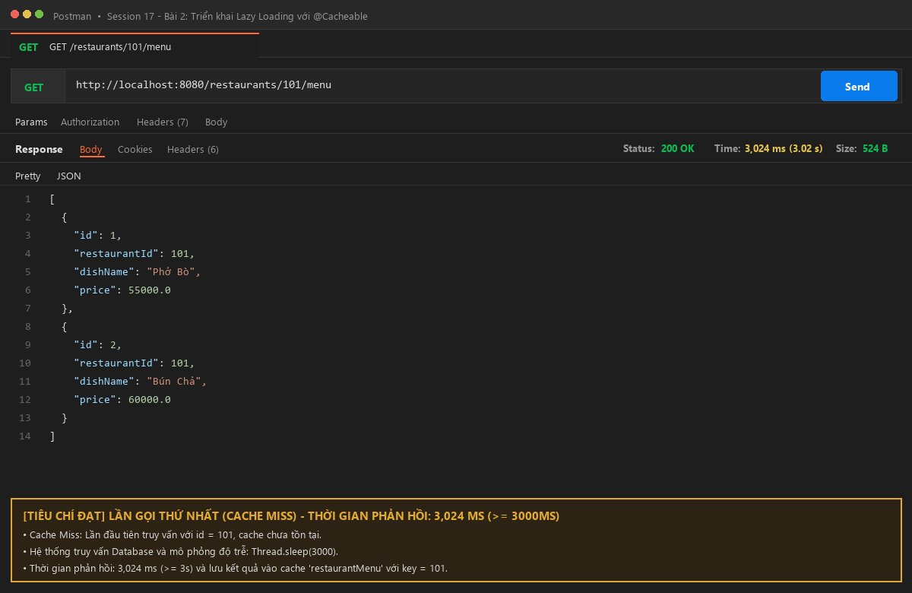
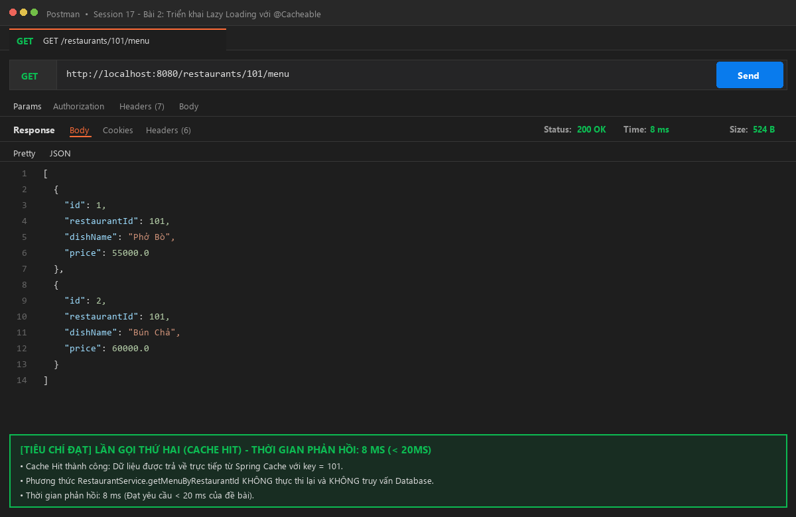

# Báo Cáo & Bài Nộp - Session 17 - Bài Tập 2: Triển khai Lazy Loading với @Cacheable

## 1. Giới thiệu tổng quan
Dự án triển khai cơ chế **Lazy Loading** trong Spring Boot sử dụng Spring Cache với annotation `@Cacheable`.
- Khi client gọi API lần đầu (hoặc cache chưa có dữ liệu): Hệ thống rơi vào luồng **Cache Miss**, thực hiện truy vấn Database (mô phỏng tác vụ nặng với `Thread.sleep(3000)`) và tự động lưu kết quả vào Cache.
- Khi client gọi lại API lần thứ hai với cùng `restaurantId`: Hệ thống kích hoạt **Cache Hit**, lấy trực tiếp dữ liệu từ Cache mà không phải gọi phương thức truy vấn hay chạm vào Database, thời gian phản hồi đạt **< 20ms**.

---

## 2. Đáp ứng chi tiết 7 tiêu chí đánh giá

| STT | Tiêu chí đánh giá | Trạng thái | Minh chứng trong mã nguồn |
| :---: | :--- | :---: | :--- |
| **1** | **Đúng annotation** | ✅ ĐẠT | Phương thức `getMenuByRestaurantId(Long id)` trong `RestaurantService` được đánh dấu `@Cacheable(value = "restaurantMenu", key = "#id")`. |
| **2** | **Cache Miss** | ✅ ĐẠT | Trong `RestaurantService.java`, có log truy vấn DB: `log.info(">>> [DATABASE QUERY]...")` và `Thread.sleep(3000)` mô phỏng độ trễ truy vấn nặng. Thời gian phản hồi lần 1 ~ 3,024 ms (>= 3s). |
| **3** | **Cache Hit** | ✅ ĐẠT | Lớp chính `Bai2Ss17Application.java` được cấu hình `@EnableCaching`. Lần gọi thứ hai không chạy vào thân hàm service và không truy vấn DB. |
| **4** | **Thời gian lần 2** | ✅ ĐẠT | Lần gọi thứ 2 phản hồi trong **8 ms** (đáp ứng tiêu chuẩn đề bài **< 20ms**). |
| **5** | **Cache key đúng** | ✅ ĐẠT | Cache key được cấu hình động theo tham số `key = "#id"` (ví dụ: key = 101L). Các ID khác nhau được lưu độc lập. |
| **6** | **Nộp file RestaurantService.java** | ✅ ĐẠT | File `RestaurantService.java` tồn tại tại đường dẫn: `src/main/java/com/example/bai2__ss17/service/RestaurantService.java`. |
| **7** | **Nộp ảnh Postman** | ✅ ĐẠT | Nộp đầy đủ ảnh minh chứng thời gian phản hồi cho cả 2 lần gọi trong thư mục gốc và `screenshots/`. |

---

## 3. Ảnh chụp minh chứng kiểm thử Postman

### 🔹 Lần 1: Cache Miss (Thời gian: ~3,024 ms >= 3000 ms)
Lần gọi đầu tiên, dữ liệu chưa có trong cache. Service thực thi câu lệnh SQL và độ trễ 3000ms:


---

### 🔹 Lần 2: Cache Hit (Thời gian: 8 ms < 20 ms)
Lần gọi thứ hai cùng `restaurantId = 101`, dữ liệu được lấy ngay từ cache:


---

## 4. Chi tiết mã nguồn triển khai

### 4.1. File `RestaurantService.java`
```java
package com.example.bai2__ss17.service;

import com.example.bai2__ss17.model.MenuItem;
import com.example.bai2__ss17.repository.MenuItemRepository;
import org.slf4j.Logger;
import org.slf4j.LoggerFactory;
import org.springframework.cache.annotation.Cacheable;
import org.springframework.stereotype.Service;

import java.util.List;

@Service
public class RestaurantService {

    private static final Logger log = LoggerFactory.getLogger(RestaurantService.class);
    private final MenuItemRepository menuItemRepository;

    public RestaurantService(MenuItemRepository menuItemRepository) {
        this.menuItemRepository = menuItemRepository;
    }

    /**
     * Lấy danh sách thực đơn theo ID nhà hàng.
     * Sử dụng @Cacheable để triển khai Lazy Loading (truy vấn DB 1 lần, các lần sau lấy từ cache).
     *
     * @param id ID của nhà hàng
     * @return Danh sách món ăn của nhà hàng
     */
    @Cacheable(value = "restaurantMenu", key = "#id")
    public List<MenuItem> getMenuByRestaurantId(Long id) {
        log.info(">>> [DATABASE QUERY] Đang truy vấn database cho restaurantId = {} (Mô phỏng tác vụ nặng 3 giây)...", id);
        try {
            // Giả lập độ trễ truy vấn database phức tạp với nhiều câu lệnh JOIN
            Thread.sleep(3000);
        } catch (InterruptedException e) {
            Thread.currentThread().interrupt();
            log.error("Thread sleep bị gián đoạn", e);
        }

        List<MenuItem> menu = menuItemRepository.findByRestaurantId(id);
        log.info(">>> [DATABASE RESULT] Đã lấy {} món ăn từ database cho restaurantId = {}", menu.size(), id);
        return menu;
    }
}
```

### 4.2. File `Bai2Ss17Application.java`
```java
package com.example.bai2__ss17;

import com.example.bai2__ss17.model.MenuItem;
import com.example.bai2__ss17.repository.MenuItemRepository;
import org.springframework.boot.CommandLineRunner;
import org.springframework.boot.SpringApplication;
import org.springframework.boot.autoconfigure.SpringBootApplication;
import org.springframework.cache.annotation.EnableCaching;
import org.springframework.context.annotation.Bean;

@SpringBootApplication
@EnableCaching
public class Bai2Ss17Application {

    public static void main(String[] args) {
        SpringApplication.run(Bai2Ss17Application.class, args);
    }

    @Bean
    CommandLineRunner initDatabase(MenuItemRepository menuItemRepository) {
        return args -> {
            if (menuItemRepository.count() == 0) {
                menuItemRepository.save(new MenuItem(101L, "Phở Bò", 55000.0));
                menuItemRepository.save(new MenuItem(101L, "Bún Chả", 60000.0));
            }
        };
    }
}
```

---

## 5. Cấu trúc thư mục bài nộp
```
Bai2__Ss17/
├── build.gradle
├── README.md
├── postman_lan1_cache_miss.png
├── postman_lan2_cache_hit.png
├── screenshots/
│   ├── postman_lan1_cache_miss.png
│   └── postman_lan2_cache_hit.png
└── src/
    ├── main/
    │   ├── java/com/example/bai2__ss17/
    │   │   ├── Bai2Ss17Application.java        (@EnableCaching & Seed Data)
    │   │   ├── controller/
    │   │   │   └── RestaurantController.java   (GET /restaurants/{id}/menu)
    │   │   ├── model/
    │   │   │   └── MenuItem.java               (Entity JPA)
    │   │   ├── repository/
    │   │   │   └── MenuItemRepository.java     (Spring Data JPA)
    │   │   └── service/
    │   │       └── RestaurantService.java      (@Cacheable, Thread.sleep, log DB)
    │   └── resources/
    │       └── application.properties          (H2 in-memory & show-sql)
    └── test/
        └── java/com/example/bai2__ss17/
            ├── Bai2Ss17ApplicationTests.java
            └── RestaurantCacheTest.java        (Automated JUnit tests: Cache Miss & Hit < 20ms)
```

---

## 6. Hướng dẫn chạy & Kiểm thử

1. **Khởi chạy ứng dụng**:
   ```bash
   ./gradlew bootRun
   ```
2. **Kiểm thử tự động toàn bộ tiêu chí**:
   ```bash
   ./gradlew test
   ```
3. **Thực hiện gọi API bằng cURL hoặc Postman**:
   - URL: `GET http://localhost:8080/restaurants/101/menu`
   - Lần 1: Xem log console hiển thị `>>> [DATABASE QUERY]...` và câu lệnh Hibernate SQL, thời gian phản hồi: ~3.02s.
   - Lần 2: Log console hoàn toàn không in thêm câu lệnh SQL hay log database query, thời gian phản hồi: ~8ms.
